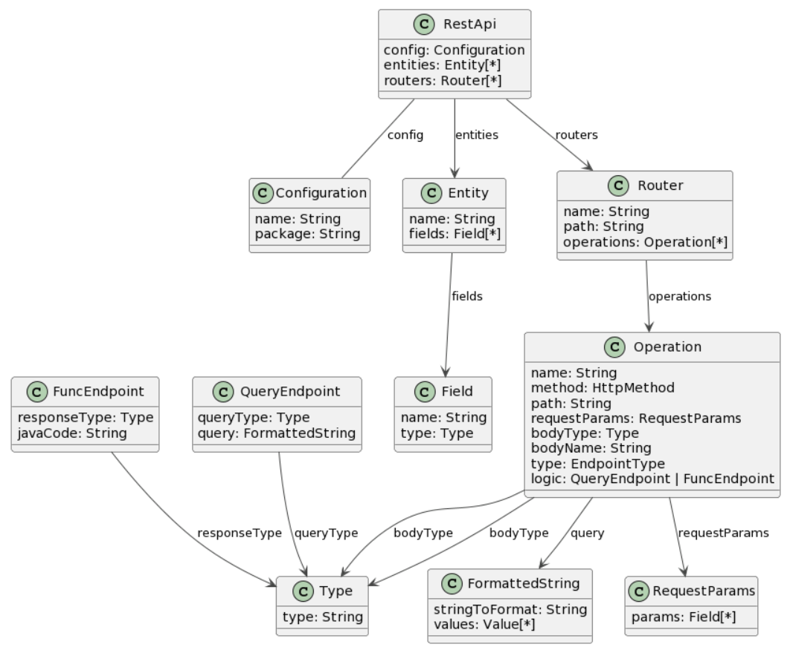

# REST DSL

## How to install

1. Clone repository in your eclipse workspace

2. Create  Xtext Project on your eclipse workspace in the same directory of the repository you just cloned.

    

3. Revert changes with this command
```
$ git reset --hard <branch-name>
```
## Project Description
1. meta-model
     
