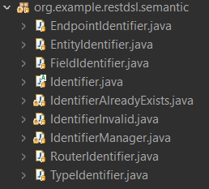
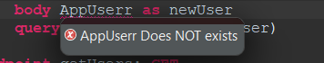
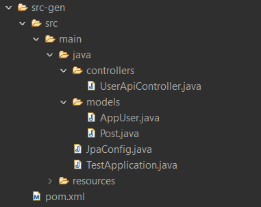

# DSL for Generating Spring Boot REST APIs

## Introduction
This readme provides an overview of a custom DSL (Domain-Specific Language) created using Eclipse Xtext and Xtend. The DSL, named RestDsl, is designed to describe RESTful APIs, configurations, entities, routers, and endpoints in a concise and expressive manner.

## Problem Statement

The development of RESTful APIs often involves a significant amount of boilerplate code and configuration. Manually writing and managing this code can be error-prone and time-consuming. The goal of creating the RestDsl is to streamline the process of defining RESTful APIs and their components, reducing the potential for errors and improving development efficiency.

## Provided Solution
The RestDsl provides a declarative syntax for describing RESTful APIs, allowing developers to focus on the essential aspects of their APIs without getting bogged down in implementation details. It leverages Eclipse Xtext for defining the language syntax and Xtend for generating executable code from the DSL specifications.


## Solution Architecture
The architecture of the solution involves two main components: the language definition using Xtext and code generation using Xtend.
     


1. Xtext:
   
    Xtext is utilized to define the grammar and syntax of the RestDsl language. The grammar includes constructs for configuring REST APIs, defining entities, routers, and endpoints. This allows developers to express their API structure in a concise and human-readable format.

2. Xtend:
   
    Xtend is employed for code generation based on the DSL specifications. Xtend templates are created to transform RestDsl models into executable Java code. This code generation step automates the tedious task of writing boilerplate code, promoting consistency and reducing the likelihood of errors.

## Meta-Model

The chosen metamodels for RestDsl include configurations, entities, routers, and endpoints. Each metamodel element captures a specific aspect of a RESTful API, enabling a comprehensive and modular description of the API structure.


## Validation

The validation rules aim to enforce uniqueness constraints within the DSL. The DSL consists of entities, routers, endpoints, request parameters, and request bodies.

The validation code is in the pacakges:

```
org.example.restdsl.semantic
org.example.restdsl.validation
```

With the main code of the validation in the class ```org.example.restdsl.validation.RestDslValidator```

and semantic validation defintions 




### 1. Initialization:

The code initializes an IdentifierManager to keep track of unique identifiers throughout the validation process.

### 2.Validation for REST API:

The main validation method (checkRestApi) checks the entire REST API for various constraints.
It ensures that entities and routers have unique names and delegates specific checks to other methods.

### 3. Entity and Router Validation:

Validation methods for entities and routers ensure that each entity and router has a unique name within the DSL.

### 4. Field Validation:

Field validation is performed within the context of entities, ensuring that fields within an entity have unique names.

### 5. Endpoint Validation:

The code validates endpoints within routers, ensuring that each endpoint has a unique name.

It also checks for uniqueness within request parameters and request bodies associated with each endpoint.

### 6. Request Parameter and Request Body Validation:

Specific validation for request parameters and request bodies ensures that they have unique names within their respective contexts.
Additionally, there are checks to ensure the validity of types associated with request parameters and request bodies.

### example
with validations, the ide will forbid the user from causing semantic errors, for example, in case of an entity that is not already existing



## Transformation

The Mechanisms allowing  the transformation of DSL specifications into executable code are mainly for Code Generation, where Xtend is used to generate Java code based on the DSL specifications, automating the creation of API-related classes and methods.
the transformation supports also custom java code snippets for more customized apis, it also handles custom Queries for Entities crud operations or direct queries


## example

after writing a proper dsl in the ide, xtend will generate a spring project automatically, for example for this dsl :

```
configuration {
	name: Test
	package: test
}

entity AppUser {
    username: String
    email: String
}

entity Post {
    title: String 
    content: String
    help: String
}

router UserApi { 
    path "/users"
    // create user endpoint
    endpoint createUser: POST
		path "/create"
		body AppUser as newUser
		query AppUser create(newUser)
		
	endpoint getUsers: GET
    	path "/"
		query AppUser read
		
	endpoint getUsersByName: GET
    	path "/name"
    	params {
    		username: String
    	}
		query AppUser jpql("SELECT e FROM AppUser e WHERE e.username = '%s'",username)
}
```

the generated spring project will look like



for the generated controller code

```
// Generate code for RestApi Controller
// You can implement the logic to generate Spring Boot code here
// Use restApi.name, restApi.path, restApi.operations, etc.
// Example:
package test.controllers;

import test.models.*;
import java.util.*;
import org.springframework.stereotype.Controller;
import org.springframework.web.bind.annotation.RequestMapping;
import org.springframework.web.bind.annotation.RequestMethod;
import org.springframework.web.bind.annotation.RequestBody;
import org.springframework.web.bind.annotation.RestController;
import org.springframework.web.bind.annotation.RequestParam;
import org.springframework.ui.Model;
import jakarta.persistence.*;
import org.springframework.beans.factory.annotation.Autowired;
import org.springframework.transaction.annotation.Transactional;

@RestController
@Transactional
@RequestMapping("/users")
public class UserApiController {
	
	
    @Autowired
    private EntityManager entityManager;
    
    
    @RequestMapping(value = "/create", method = RequestMethod.POST)
    public AppUser createUser(@RequestBody AppUser newUser
    ) {
    	// Persist the new entity
    	entityManager.persist(newUser);
    	return newUser;
    }
    @RequestMapping(value = "/", method = RequestMethod.GET)
    public List<AppUser> getUsers() {
    	TypedQuery<AppUser> query = entityManager.createQuery("SELECT e FROM AppUser e", AppUser.class);
    	return query.getResultList();
    }
    @RequestMapping(value = "/name", method = RequestMethod.GET)
    public List<AppUser> getUsersByName(@RequestParam(name = "username", required = true) String username
    ) {
    	TypedQuery<AppUser> query = entityManager.createQuery(String.format("SELECT e FROM AppUser e WHERE e.username = '%s'"
    			,username 
    			), AppUser.class);
    	return query.getResultList();
    }
}

```


and for the appUser Entity:

```
// Generate code for Entity
// You can implement the logic to generate Spring Boot code here
// Use entity.name, entity.fields, etc.
// Example:
package test.models;

import jakarta.persistence.*;
import org.springframework.ui.*;

@Entity
public class AppUser {
	// ID
	@Id
	@GeneratedValue(strategy = GenerationType.IDENTITY)
	private Long id;
	
	// get ID
	public Long getId() {
		return id;
	}
	
    // Fields
    private String username;
    private String email;
    
    // Copy Entity
    void copy(AppUser other) {
this.username = other.username;
this.email = other.email;
    }

    // Getters and setters
    public String getUsername() {
        return username;
    }

    public void setUsername(String username) {
        this.username = username;
    }
    public String getEmail() {
        return email;
    }

    public void setEmail(String email) {
        this.email = email;
    }
}
```

## How to install

1. Clone repository in your eclipse workspace

2. Create  Xtext Project on your eclipse workspace in the same directory of the repository you just cloned.


3. Revert changes with this command
```
$ git reset --hard <branch-name>
```
## How To Test the DSL
1. Custom Ide
    after updating the artifacts, you just need to run the src of the restdsl project as Eclipse IDe, inside which you can use and test the custom DSL

2. Add Run Configuration for Maven


3. Run The Application

## Conclusion
The RestDsl offers a powerful and efficient way to define RESTful APIs with minimal effort. By leveraging Eclipse Xtext and Xtend, developers can articulate API structures in a concise DSL, leading to automatic code generation that significantly accelerates the development process. This approach enhances maintainability, reduces errors, and promotes consistency in API design.

## the team
Hachim HASSANI LAHSINUI

KSIKS Mohamed Haitam

BARKALLIL Rayan

MOUTAOIKIL ANAS