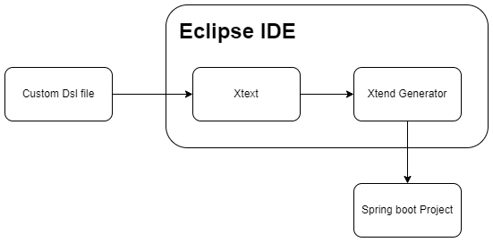
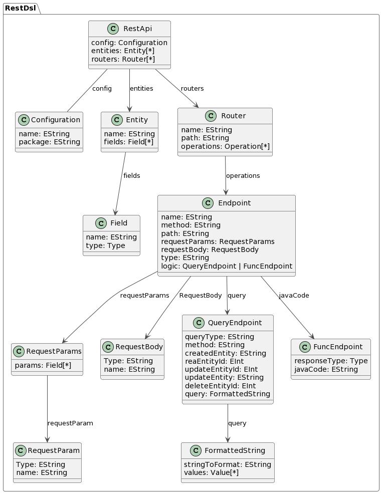

# DSL for Generating Spring Boot REST APIs

## Introduction
This readme provides an overview of a custom DSL (Domain-Specific Language) created using Eclipse Xtext and Xtend. The DSL, named RestDsl, is designed to describe RESTful APIs, configurations, entities, routers, and endpoints in a concise and expressive manner.

## Problem Statement

The development of RESTful APIs often involves a significant amount of boilerplate code and configuration. Manually writing and managing this code can be error-prone and time-consuming. The goal of creating the RestDsl is to streamline the process of defining RESTful APIs and their components, reducing the potential for errors and improving development efficiency.

## Provided Solution
The RestDsl provides a declarative syntax for describing RESTful APIs, allowing developers to focus on the essential aspects of their APIs without getting bogged down in implementation details. It leverages Eclipse Xtext for defining the language syntax and Xtend for generating executable code from the DSL specifications.


## Solution Architecture
The architecture of the solution involves two main components: the language definition using Xtext and code generation using Xtend.
     


1. Xtext:
   
    Xtext is utilized to define the grammar and syntax of the RestDsl language. The grammar includes constructs for configuring REST APIs, defining entities, routers, and endpoints. This allows developers to express their API structure in a concise and human-readable format.

2. Xtend:
   
    Xtend is employed for code generation based on the DSL specifications. Xtend templates are created to transform RestDsl models into executable Java code. This code generation step automates the tedious task of writing boilerplate code, promoting consistency and reducing the likelihood of errors.

## Meta-Model

The chosen metamodels for RestDsl include configurations, entities, routers, and endpoints. Each metamodel element captures a specific aspect of a RESTful API, enabling a comprehensive and modular description of the API structure.




## Transformation

The Mechanisms allowing  the transformation of DSL specifications into executable code are mainly for Code Generation, where Xtend is used to generate Java code based on the DSL specifications, automating the creation of API-related classes and methods.
the transformation supports also custom java code snippets for more customized apis, it also handles custom Queries for Entities crud operations or direct queries


## How to install

1. Clone repository in your eclipse workspace

2. Create  Xtext Project on your eclipse workspace in the same directory of the repository you just cloned.

    

3. Revert changes with this command
```
$ git reset --hard <branch-name>
```
## How To Test the DSL
1. Custom Ide
    after updating the artifacts, you just need to run the src of the restdsl project as Eclipse IDe, inside which you can use and test the custom DSL

2. Add Run Configuration for Maven
    

3. Run The Application

## Conclusion
The RestDsl offers a powerful and efficient way to define RESTful APIs with minimal effort. By leveraging Eclipse Xtext and Xtend, developers can articulate API structures in a concise DSL, leading to automatic code generation that significantly accelerates the development process. This approach enhances maintainability, reduces errors, and promotes consistency in API design.

## the team
Hachim HASSANI LAHSINUI

KSIKS Mohamed Haitam

BARKALLIL Rayan

MOUTAOIKIL ANAS